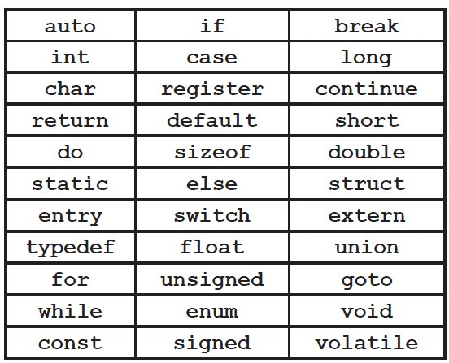

## C Programming - Misc

### Header Files
Header files allow you to separate function declaration and definitions.  

- Use quotes for the header file name.  This tells the compiler to look for a local file (same directory and main.c).
- #include is a preprocessor instruction.
- Header files allow you to define functions as well as the return type.  Without header files, if C finds a function it hasn't heard of already, it *assumes* the return type is an int.

**Header File: addtax.h**
```sh
float add_with_tax(float f);
```

**Main**
```sh
#include <stdio.h>
#include "addtax.h" // <<Use quotes here ""
int main() {
....
}

float add_with_tax(float f){
...
}
```

### Multiple C Files

Code can be split between multiple C files for reusability.

1. Create multiple .c files that contain one or more functions.
2. Create a header (.h) file that contains the declaration to a function included in a separate .c file.
3. In the primary and secondary .c files, include the reference to the .h file.

```sh
**encrypt.h**
-------------

void encrypt(char *message);

**encrypt.c**
-------------

#include "encrypt.h"

void encrypt(char *message) {
...
}

**message_hider.c**
-------------------

#include <stdio.h>
#include "encrypt.h"

int main(){
...
}
```

When compiling the files, you need to include all .c file name(s):
`gcc message_hider.c encrypt.c -o message_hider.exe`


#### Compiling Multiple Files - Strategy #1

When you have multiple .c files, you don't always need to recompile all of them if only 1 or 2 lines in one file have changed.  

1. Create object files. Use the following command to generate output files for your C code: `gcc -c *.c`.  
**Note:** This will compile all files in the current directory..  Be careful.

2. Make changes to .c files as needed.  Create new object file. `gcc -c file_i_changed.c`

3. Compile all object files. `gcc *.o -o myexecutable.exe`

For a better approach, see make

### make

make allows you to create an *automated, multi-step process to compile code when changes are made.  

> **target_name:** dependencies1 dependencies2 dependencies3...
> &nbsp; &nbsp; &nbsp; &nbsp; gcc -options filname(s)    //This line MUST begin with a tab

The contents must be saved in a file called Makefile or makefile
```sh
message_hider.o: message_hider.c encrypt.h
        gcc -c message_hider.c

encrypt.o: encrypt.c encrypt.h
        gcc -c encrypt.c

message_hider: message_hider.o encrypt.o
        gcc message_hider.o encrypt.o -o message_hider.exe
```

**Usage**
I think you can simply use `make target` where *target* is the target from the makefile you want to create (e.g. message_hider)

`make message_hider`

### Reserved Words

;


### Quick guide to Data Types

- **char:** Each character is stored in the computer’s memory as a character code. And that’s just a number. So when the computer sees A *(65 is the ASCII code for A)*, to the computer it’s the same as seeing the literal number 65.
- **int:** If you need to store a whole number, you can generally just use an int. The exact maximum size of an int can vary, but it’s guaranteed to be at least 16 bits. In general, an int can store numbers up to a few million.
- **short:** But sometimes you want to save a little memory. Why use an int if you just want to store numbers
up to few hundreds or thousands? That’s what a short is for. A short number usually takes up
about half the space of an int
- **long:** Yes, but what if you want to store a really large count? That’s what the long data type was invented for. On some machines, the long data type takes up twice the memory of an int, and it can hold numbers up in the billions. But because most computers can deal with really large ints, on a lot of machines, the long data type is exactly the same size as an int. The maximum size of a long is guaranteed to be at least 32 bits.
- **float:** float is the basic data type for storing floating-point numbers. For most everyday floating-point numbers—like the amount of fluid in your orange mocha frappuccino—you can use a float.
- **double:** Yes, but what if you want to get really precise? If you want to perform calculations that are accurate to a large number of decimal places, then you might want to use a double. A double takes up twice the memory of a float, and it uses that extra space to store numbers that are larger and more precise.

#### Datatype Prefix

- **unsigned**: The number will always be positive.  Effectively doubles the size of the number that can be stored as an extra bit is gained that normally would have determine (+) or (-).

- **long**: longer version of an int or double.

- **long long**: even bigger

#### Datatypes: Bytes

- limits.h has values for the integer types like int and char
- float.h has values for floats and doubles
- sizeof returns the number of bytes a data type occupies.
- For other types, replace INT and FLT with CHAR (chars), DBL
(doubles), SHRT (shorts), or LNG (longs).

```sh
#include <stdio.h>
#include <limits.h>
#include <float.h>
int main()
{
printf("The value of INT_MAX is %i\n", INT_MAX);
printf("The value of INT_MIN is %i\n", INT_MIN);
printf("An int takes %li bytes\n", sizeof(int));
printf("The value of FLT_MAX is %f\n", FLT_MAX);
printf("The value of FLT_MIN is %.50f\n", FLT_MIN);
printf("A float takes %li bytes\n", sizeof(float));
return 0;
}
```


### Cast

Cast converts data type on the fly.

```sh
int x = 7;
int y = 2;

float a = x / y;  //3.000000
float b = (float) x / (float) y; //3.500000 
float c = (float) x / y; //3.500000 
```
- **a:** x and y are ints and the decimal is dropped, resulting in 3.
- **b:** x and y are casted as floats and the result includes the decimal.
- **c:** Same as b, but C will automatically cast the second value if it determines you are attempting to divide a float with an int.

