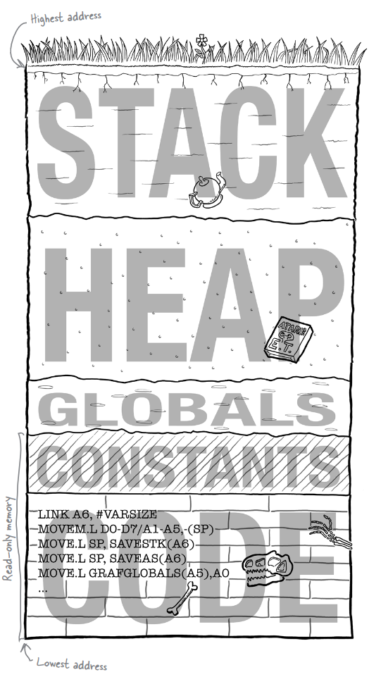

## Understanding Memory

### Stack

This is the section of memory used for **local variable storage***.  Every time you call a function, all of the function's local variables get created on the stack.  
- Variables get addeded to the stack when you enter a function; and get take off the stack when you live.
- The stack actually works upside down. It starts at the top of the memory and **grows downward**.

### Heap

This is a section for **dynamic memory** pieces of data that get created when the program is running and then hang around a long time.

### Globals

A variable that lives outside of all of the functions and is visible to all of them.  Get created when the program first runs, and you can update them freely.

### Constant

Created when the program first runs, they are stored in **read-only** memory.  Constants are things like *string literals* that you will need when the program is running, but you'll never want them to change.

### Code

A lot of operating systems place the code in the lowest memory addresses.
- The code segemtn is read-only.
- This is the part fo the memory where the actual assembled code gets loaded.